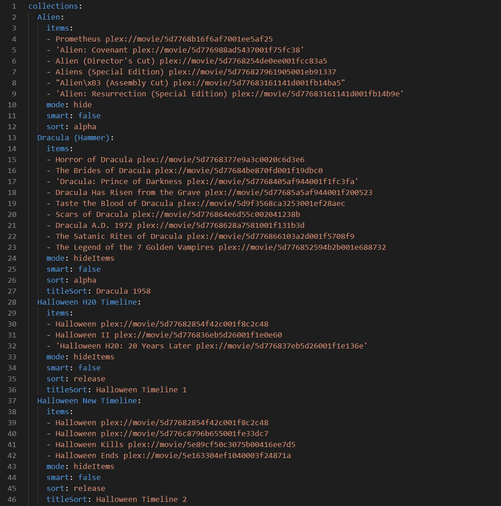

# plex-collection-maker

Create a collection in TV and Movie libraries from a text file list of shows or movies. This allows you to back-up and
easily recreate standard collections in your plex library.

This is a initially manual process to build the collections,
for an automatic builder using external lists see **[PMM](https://github.com/meisnate12/Plex-Meta-Manager)**.

## Setup

<details>
<summary>Virtual environment</summary>

### Create/activate a virtual environment

```bash
# Virtualenv modules installation (Linux/Mac based systems)
python3 -m venv env
source env/bin/activate

# Virtualenv modules installation (Windows based systems)
python -m venv env
.\env\Scripts\activate

# Virtualenv modules installation (Windows based systems if using bash)
python -m venv env
source ./env/Scripts/activate
```

</details>

---
Install dependencies

```bash
pip install -r requirements.txt
```

Create .env file from [.env.example](./.env.example) with Plex credentials
(server IP address, api token, and library names).

Public IP is optional if you will only run script locally to the Plex server.

Your Plex token can be found
**[here](https://support.plex.tv/articles/204059436-finding-an-authentication-token-x-plex-token/)**

From the XML information of a library item (the same place the Plex token was found) you can find the Plex GUID of
that specific library item to use for accurate identification. Otherwise, you can use the provided library dumping
command to get a list of the names and GUIDs for all items in the provided libraries.

Create a config.yml file from [config.template.yml](./config.template.yml) with the paths to your individual collection
configuration files. You will have one config.yml file, but you can have as many collection config files as you want
per library. Be aware, if collections in separate files for the same library have the same name, the collection config
in the earlier file will be discarded.

## Usage

Below are examples of collection configuration files. Only the collection title header and items list are necessary to
create a collection, but there are many other options available.

These are the outputs of the dump functions and include the Plex GUID for each item. These are also not necessary, but
should ensure accurate item identification when adding to a collection.

<p align="center">
    
    
</p>

To make and/or sync existing collections

```bash
python main.py
```

You can also dump lists of existing collections to file, and exclude collection editing

```bash
python main.py --dump-collections --exclude-edit
```

As well as dump the entire contents of existing existing libraries to file

```bash
python main.py --dump-libraries --all-fields --exclude-edit
```
